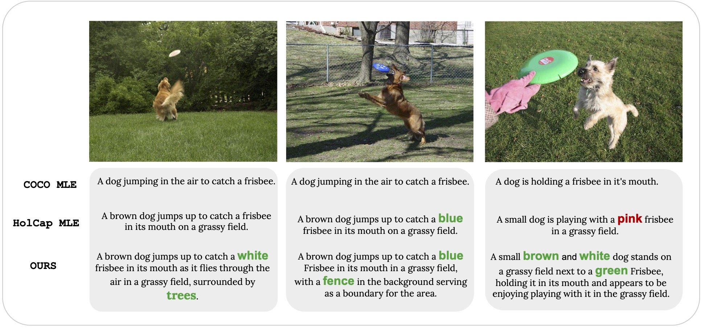

# No Detail Left Behind: Revisiting Self-Retrieval for Fine-Grained Image Captioning

[Manu Gaur](https://manugaurdl.github.io/), [Darshan Singh S](https://darshansingh11.github.io/), [Makarand Tapaswi](https://makarandtapaswi.github.io/)

<p align="center">
  
</p>

<p float="left">
  <a href="https://arxiv.org/abs/2409.03025">
    
  </a>
  <a href="https://katha-ai.github.io/projects/no-detail-left-behind/">
    
  </a>
<a href="https://huggingface.co/manu-gaur/NDLB" target="_blank">
    
</a>
<a href="https://huggingface.co/datasets/manu-gaur/NDLB-TrueMatch-Benchmark" target="_blank">
    
</a>
<a href="https://huggingface.co/datasets/manu-gaur/NDLB_data" target="_blank">
    
</a>
</p>


## Welcome to the code repository for TMLR 2024 accepted paper No Detail Left Behind. 
### This repository contains data and code for self-retrieval evaluation on the <i>TrueMatch</i> benchmark + MLE training, REINFORCE fine-tuning.

### :zap:	For instant visualization of data samples, please visit our [Project Page](https://katha-ai.github.io/projects/no-detail-left-behind/)

## :toolbox: Setting up the repository
### :earth_asia: Setting up the environment
```
conda create -n d3 python=3.10 -y
conda activate ndlb
pip install -r requirements.txt
```


## Setting-up TrueMatch Benchmark 💿

- The benchmark is available at [Huggingface](https://huggingface.co/datasets/manu-gaur/NDLB-TrueMatch-Benchmark).
- Make sure you have [git-lfs](https://github.com/conda-forge/git-lfs-feedstock) installed.

```
mkdir data && cd data
git clone https://huggingface.co/datasets/manu-gaur/NDLB-TrueMatch-Benchmark

```
Ensure the following directory structure for `NDLB-TrueMatch-Benchmark`

```
├── truematch_images
│   ├── COCOID.jpg
│   ├── COCOID.jpg
│   ├── ...
├── benchmark
│   ├── 1.json
│   ├── 3.json
│   ├── ...
├── test_val_cocoid2idx.json

```
The `benchmark` folder contains JSON files, each named by bag_size. Each JSON file lists groups of images (_bags_), where each _bag_ includes the COCOIDs of its images.

<br>

## Self-Retrieval Evaluation on <i>TrueMatch</i>

1. Generate fine-grained captions for each image in `./data/NDLB-TrueMatch-Benchmark/truematch_images`. 
2. Store the generated captions in a python dict as a `.pkl` file with (COCOID, Caption) as key-value pairs.

Simply extract COCOID for each image from its filename:
```python
filename = "COCO_val2014_000000003310.jpg"
cocoid = int(filename.split(".")[0].split("_")[-1])
```

3. To evaluate the captioning system on the <i>TrueMatch</i> benchmark, run: 

```bash
python truematch_eval.py \
  --preds_path [PATH_TO_GENERATED_CAPTIONS] \
  --out_dir [PATH_TO_YOUR_OUTPUT_DIR]
```
You can adjust the following:

- `--preds_path`: Path to captions independently generated by your model for _TrueMatch_ images
- `---out_dir`: Path to a directory to store R@1 scores for all bags in _TrueMatch_
<br>

## MLE and REINFORCE (CIDEr, SR, CIDEr + SR) Training 


To MLE train CLIPCap on a particular dataset [COCO, BlendCap, HolisticCap], run:
```
python -m egg.zoo.emergent_captioner.finetuning.train dataset mle
```

To REINFORCE fine-tune a model with a particular reward (SR, CIDEr) that has been MLE trained with a dataset [COCO, BlendCap, HolisticCap], run:
```
python -m egg.zoo.emergent_captioner.finetuning.train dataset reward
```


## BibTeX
If you find our work useful, please cite as below

```
@article{gaur2024detect,
  title={No Detail Left Behind: Revisiting Self-Retrieval for Fine-Grained Image Captioning},
  author={Gaur, Manu and Singh S, Darshan and Tapaswi, Makarand.},
  journal={arXiv preprint arXiv:2409.03025},
  year={2024}
}
```

[![CC BY-NC-SA 4.0][cc-by-nc-sa-shield]][cc-by-nc-sa]

This work is licensed under a
[Creative Commons Attribution-NonCommercial-ShareAlike 4.0 International License][cc-by-nc-sa].

[![CC BY-NC-SA 4.0][cc-by-nc-sa-image]][cc-by-nc-sa]

[cc-by-nc-sa]: http://creativecommons.org/licenses/by-nc-sa/4.0/
[cc-by-nc-sa-image]: https://licensebuttons.net/l/by-nc-sa/4.0/88x31.png
[cc-by-nc-sa-shield]: https://img.shields.io/badge/License-CC%20BY--NC--SA%204.0-lightgrey.svg


